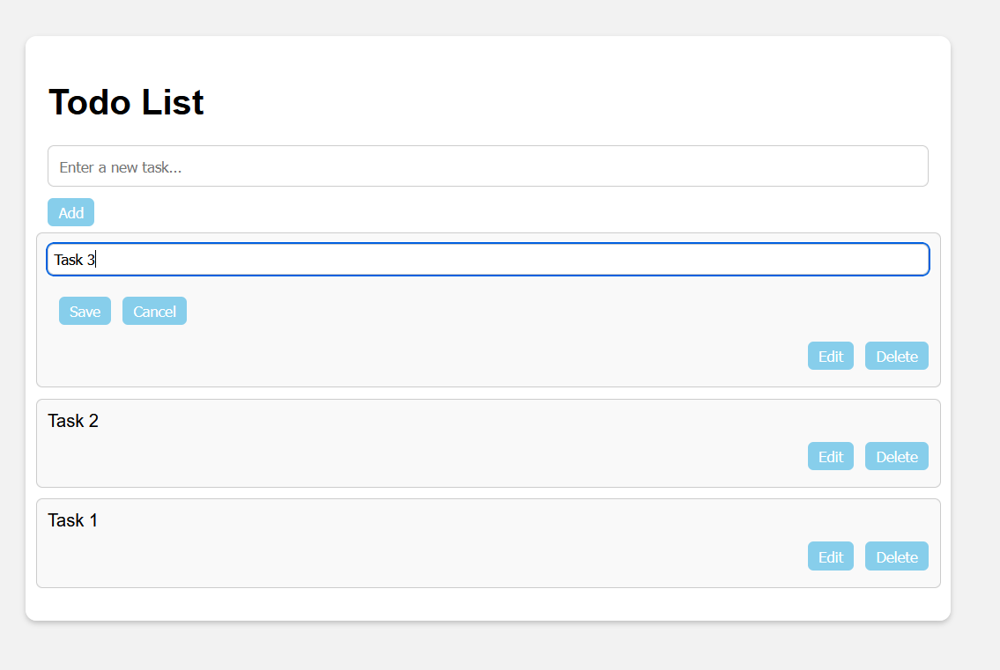

<h1 align="center"> React Study Tools </h1>

# To Do App: #

A simple ToDo app built using React for managing your tasks.

## Features

- Add new tasks to your todo list.
- Delete tasks from your todo list.
- Edit existing tasks.

## Screenshot



## Installation

To run this project locally, follow these steps:

1. Clone the repository to your local machine:

```
git clone https://github.com/Shancakes/StudyTools.git
```

2. Navigate to the project directory:

```
cd react-todo-app
```

3. Install the project dependencies:

```
npm install 
```

4. Start the development server:

```
npm start
```

